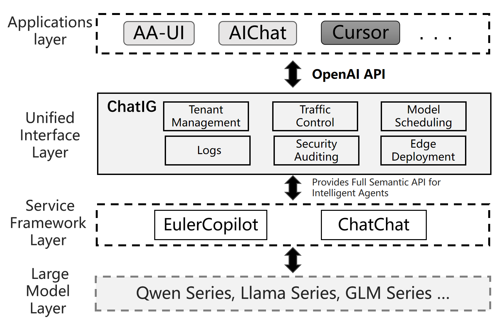

# Chatig

#### Introduction
Chatig is an efficient and unified inference gateway designed to provide developers and enterprises with an OpenAI-compatible API layer, acting as an intermediary between intelligent applications and large model services. With Chatig, developers can more easily integrate large model services, empowering intelligent applications.

#### Software Architecture
Chatig integrates modules such as tenant management, traffic control, model scheduling, and security auditing. In addition to offering a unified API interface, it enables flexible multi-model switching, model management, data privacy protection, and usage log monitoring. This helps developers and enterprises manage and optimize the deployment and operation of intelligent applications more efficiently.

#### Installation Guide

1. Install the [copilot](https://gitee.com/openeuler/euler-copilot-framework/blob/master/docs/user-guide/%E9%83%A8%E7%BD%B2%E6%8C%87%E5%8D%97/%E7%BD%91%E7%BB%9C%E7%8E%AF%E5%A2%83%E4%B8%8B%E9%83%A8%E7%BD%B2%E6%8C%87%E5%8D%97.md) or [chatchat](https://github.com/chatchat-space/Langchain-Chatchat) large model service framework.
2. Follow the [installation documentation](./docs/pgsql/env_setup.md) to install pgsql.
3. Modify Chatig's configuration files (`./src/configs/`) and pgsql environment variables (`./.env`).
4. Run directly: `cargo run`

#### Usage Instructions

Provides the API endpoint `/v1/chat/completions` for applications such as [AA-UI](https://gitee.com/openeuler/aa-ui) and [cursor](https://www.cursor.com/).

#### Contribution Guide

1. Fork this repository.
2. Create a new branch `Feat_xxx`.
3. Commit your code.
4. Create a Pull Request.
