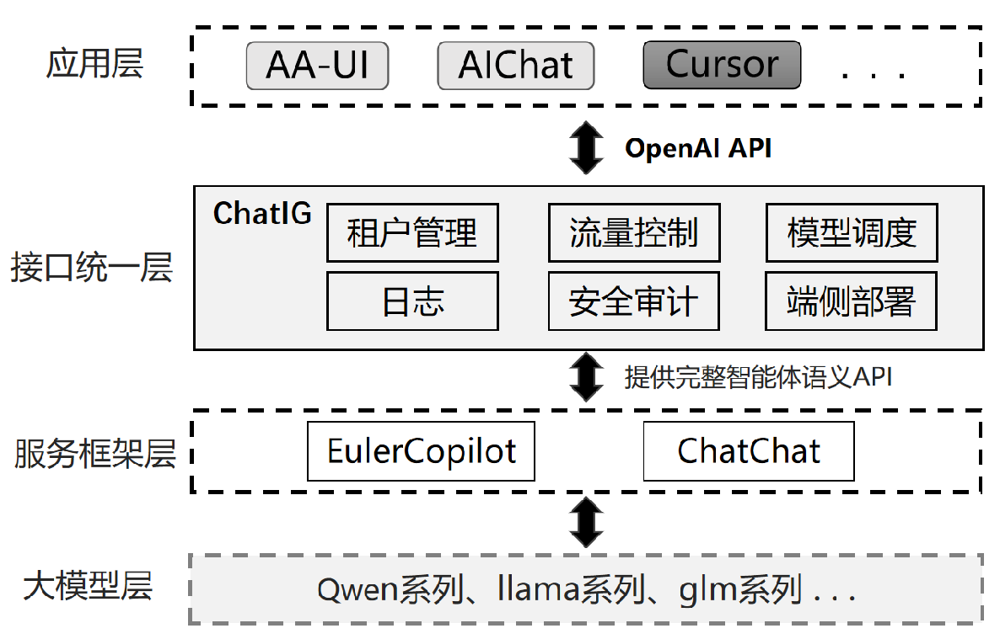

# chatig

#### 介绍
Chatig 是一个高效、统一的推理网关，旨在为开发者和企业提供兼容OpenAI的API层，充当了智能应用与大模型服务之间的中介。通过Chatig，开发者能够更轻松地接入大模型服务，为智能应用赋能。

#### 软件架构
Chatig 集成租户管理、流量控制、模型调度、安全审计等模块，除了提供统一的API接口，还能够实现多模型灵活切换、模型管理、数据隐私保护及使用日志监控等功能，帮助开发者和企业更高效地管理和优化智能应用的部署与运行。

#### 安装教程

1.  安装[copilot](https://gitee.com/openeuler/euler-copilot-framework/blob/master/docs/user-guide/%E9%83%A8%E7%BD%B2%E6%8C%87%E5%8D%97/%E7%BD%91%E7%BB%9C%E7%8E%AF%E5%A2%83%E4%B8%8B%E9%83%A8%E7%BD%B2%E6%8C%87%E5%8D%97.md)或者[chatchat](https://github.com/chatchat-space/Langchain-Chatchat)大模型服务框架。
2.  按照[安装文档](./docs/pgsql/env_setup.md)，安装pgsql。
3.  修改chatig的配置文件（./src/configs/）与pgsql环境变量(./.env)。
4. 直接运行：`cargo run`

#### 使用说明

提供Api接口`/v1/chat/completions`接口供[AA-UI](https://gitee.com/openeuler/aa-ui)、[cursor](https://www.cursor.com/)等应用使用。

#### 参与贡献

1.  Fork 本仓库
2.  新建 Feat_xxx 分支
3.  提交代码
4.  新建 Pull Request
