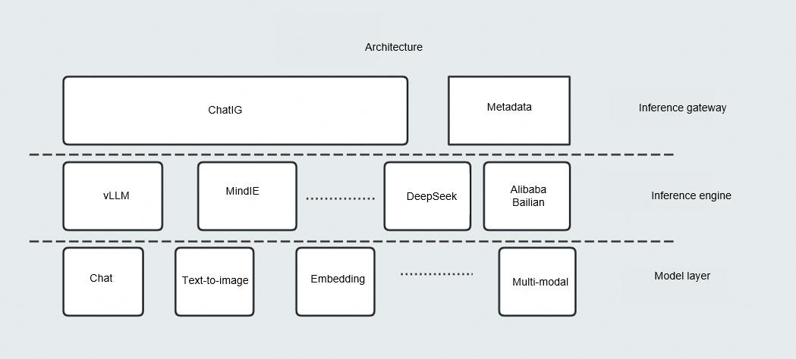

# ChatIG
English | [简体中文](./README.md)

## Overview

ChatIG is a high-performance, unified inference gateway designed to provide developers and enterprises with an OpenAI-compatible API layer. Acting as a lightweight intermediary between intelligent applications and foundation model backends, ChatIG simplifies the integration of downstream model services to power intelligent applications efficiently.

## Software Architecture

ChatIG integrates core modules including tenant management, traffic control, model scheduling, and security auditing. In addition to exposing a unified API, it supports dynamic model switching, centralized model management, data privacy protection, and log monitoring. This enables developers and enterprises to seamlessly manage and optimize the deployment and runtime execution of intelligent applications.

## Supported Models

- llama3
- qwen2.5
- bge
- stable-diffusion
- whisper
- TBD

## Installation

1. Deploy any target inference engine, such as [vLLM](https://github.com/vllm-project/vllm).
2. Install and configure PgSQL by following the [its installation guide](./docs/pgsql/install&init(apt).md).
3. Modify the ChatIG configuration file (`./src/configs/`) and PgSQL environment variables in `./.env`.
4. Directly run `cargo run`.

## Instructions

The API `/v1/chat/completions` is provided for [AA-UI](https://gitee.com/openeuler/aa-ui) and [cursor](https://www.cursor.com/).

## Contribution

Contributions are welcome! Please submit a Pull Request (PR) directly. For bug reports, feature requests, or discussions, feel free to open an issue.
