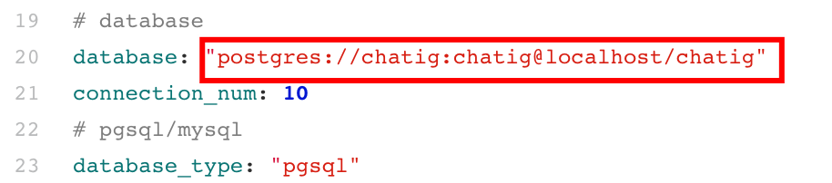
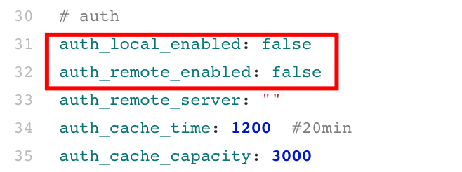

# Chatig 部署文档

**Chatig部署一共需要2个前置环境：**

​	**1. rust等linux依赖包。**

​	**2. pgsql数据库（可远程）。**

### （一）安装rust等linux依赖包

#### 1. 安装rust

打开终端并输入下面命令：

```bash
curl --proto '=https' --tlsv1.2 https://sh.rustup.rs -sSf | sh
```
这个命令将下载一个脚本并开始安装 `rustup` 工具，此工具将安装 Rust 的最新稳定版本。可能会提示你输入管理员密码。
如果安装成功，将出现下面这行：

```bash
Rust is installed now. Great!
```

OK，这样就已经完成 Rust 安装啦。

**（1） 更新**

要更新 Rust，在终端执行以下命令即可更新：

```bash
rustup update
```

**（2） 卸载**

要卸载 Rust 和 `rustup`，在终端执行以下命令即可卸载：

```bash
rustup self uninstall
```

**（3） 检查安装是否成功**

检查是否正确安装了 Rust，可打开终端并输入下面这行，此时能看到最新发布的稳定版本的版本号、提交哈希值和提交日期：

```bash
$ rustc -V
rustc 1.56.1 (59eed8a2a 2021-11-01)

$ cargo -V
cargo 1.57.0 (b2e52d7ca 2021-10-21)
```

> 注：若发现版本号不同，以您的版本号为准

恭喜，你已成功安装 Rust！


#### 2. 安装linux依赖包

- **CentOS系列**

```bash
sudo yum update
sudo yum install -y gcc openssl-devel libffi-devel 
```

- **Ubuntu系列**

```bash
sudo apt update
sudo apt install -y gcc libssl-dev libffi-dev libpq-dev
```


### （二）安装psql

请参考`pgsql部署`文档


### （三）运行chatig

#### 1. 源码运行

**gitee：**https://gitee.com/openeuler/chatig.git

**（1）下载源码**

下载代码请复制以下命令到终端执行：

```bash
git clone https://gitee.com/openeuler/chatig.git
```


**（2）修改配置文件**

```bash
vim src/configs/configs.yaml
```

修改配置文件中的数据库连接信息



修改格式：`postgres://<用户名>:<密码>@<psql-ip>:<port>/<数据库名>`


**（3）运行代码**

```bash
# 源代码前端启动
cargo run

# 源代码后台启动
nohup cargo run > chatig.log 2>&1 &
```


**（3）开启远程或者本地鉴权（可选）**

如果想要开启 本地/远程 鉴权，需要将配置文件中下面参数修改为`true`，然后重启`chatig`即可。



开启后，需要去数据库中设置自定义的`apikey`，一共需要修改两个数据表`UserKeys ` 与`UserKeysModels`，例如：

```sql
INSERT INTO UserKeys (userkey) VALUES 
('sk-5gTqDIfgnLIsdYhBzKpW3sicngcH348D'),
('sk-Zx7wVdiNDSgdisesdDdP1rDs9I4lOdh8');

INSERT INTO UserKeysModels (userkey, model) VALUES 
('sk-5gTqDIfgnLIsdYhBzKpW3sicngcH348D', 'all'),
('sk-Zx7wVdiNDSgdisesdDdP1rDs9I4lOdh8', 'all');
```

`UserKeys`表格用于鉴权是否为合法`apikey`，`UserKeysModels`表格用于鉴权该`apices`是否有获取某个模型的权利，`all`表示所有模型。


**（4）开启qos限流监控（可选）**

如果要开启使用qos，请参考 [Chatig qos设计部署文档](https://alidocs.dingtalk.com/i/nodes/oP0MALyR8k7yrYM2t7qlv2n483bzYmDO)


#### 2. docker部署


#### 3. 通过安装包


